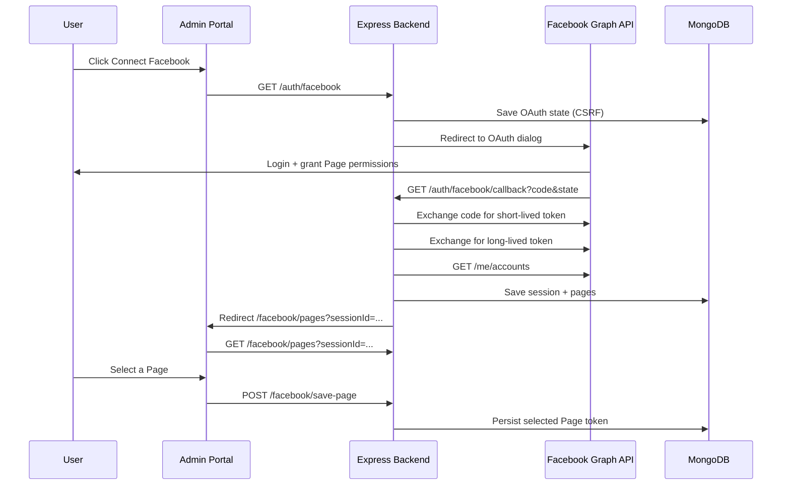

# Facebook OAuth Integration — Setup & Testing

Backend-only Facebook Login + Page selection. Wire the UI into your **existing admin portal** (no separate frontend in this repo).

## Architecture



## Backend folder structure

```
my-backend/my-backend/
  routes/facebookRoutes.js
  controllers/facebookController.js
  services/facebookService.js
  models/FacebookConnection.js
  models/FacebookOAuthState.js
```

## Environment variables

```env
FACEBOOK_APP_ID=your_app_id
FACEBOOK_APP_SECRET=your_app_secret
FACEBOOK_REDIRECT_URI=http://localhost:5000/auth/facebook/callback
FRONTEND_URL=https://your-admin-portal-url.com
CORS_ORIGINS=https://your-admin-portal-url.com
MONGO_URI=mongodb://127.0.0.1:27017/poster_app
```

| Variable | Purpose |
|----------|---------|
| `FRONTEND_URL` | Where users land after OAuth (`/facebook/pages?sessionId=...`) |
| `FACEBOOK_REDIRECT_URI` | Backend callback — must match Meta app settings |
| `CORS_ORIGINS` | Admin portal origin(s) allowed to call the API |

## API endpoints

| Method | Path | Description |
|--------|------|-------------|
| GET | `/auth/facebook` | Redirect to Facebook OAuth |
| GET | `/auth/facebook/callback` | Handle OAuth callback |
| GET | `/facebook/pages?sessionId=` | List Pages for session |
| POST | `/facebook/save-page` | Save selected Page |
| POST | `/facebook/post-image` | Post image URL to Page |

## Admin portal integration

### 1. Connect button

Link directly to the backend (full page redirect):

```html
<a href="https://your-api.com/auth/facebook">Connect Facebook</a>
```

Optional: pass your app user id for linking:

```
GET /auth/facebook?userId=<mongoUserId>
```

### 2. Page selection route

Create a route at **`/facebook/pages`** in your admin portal. After OAuth, the backend redirects to:

```
https://your-admin-portal-url.com/facebook/pages?sessionId=abc123
```

Read `sessionId` from the query string, then call the API:

```js
// Load pages
const { data } = await axios.get(`${API_URL}/facebook/pages`, {
  params: { sessionId },
});

// data.pages → [{ pageId, pageName, pageAccessToken }, ...]

// Save selected page
await axios.post(`${API_URL}/facebook/save-page`, {
  sessionId,
  pageId: selectedPageId,
});
```

### 3. Sample post

```js
await axios.post(`${API_URL}/facebook/post-image`, {
  pageId,
  pageAccessToken,
  imageUrl: "https://example.com/poster.jpg",
  caption: "Hello from Poster SaaS",
});
```

## Run backend

```bash
cd my-backend
npm install
npm run dev
```

## Test with Meta Developer App

### 1. Create app

[developers.facebook.com](https://developers.facebook.com/) → **My Apps → Create App** → **Business**.

### 2. Add Facebook Login

**Add Product → Facebook Login → Set Up** → Web.

### 3. OAuth redirect URI

**Facebook Login → Settings → Valid OAuth Redirect URIs:**

```
http://localhost:5000/auth/facebook/callback
```

Production: `https://your-api.com/auth/facebook/callback`

### 4. App credentials

**App Settings → Basic** → copy App ID and App Secret into `.env`.

### 5. Permissions (already in code)

- `pages_show_list` — list Pages the user manages
- `pages_manage_posts` — post posters to the selected Page

Do **not** add `pages_read_engagement` unless Meta explicitly approves it for your app; it often shows **Invalid Scopes** during login.

### 6. Verify

1. Admin portal: open Connect Facebook → Facebook login
2. Redirect to `/facebook/pages?sessionId=...`
3. List pages → select one → save
4. Test image post with a public HTTPS image URL

### Common errors

| Error | Fix |
|-------|-----|
| Redirect URI mismatch | Meta dashboard URI must match `FACEBOOK_REDIRECT_URI` exactly |
| Wrong page after login | Set `FRONTEND_URL` to your admin portal URL |
| CORS blocked | Add admin portal URL to `CORS_ORIGINS` |
| No Pages returned | Facebook user must be Page admin/editor |

## Production checklist

- [ ] `FRONTEND_URL` = production admin portal URL
- [ ] `CORS_ORIGINS` includes production admin portal URL
- [ ] `FACEBOOK_REDIRECT_URI` = production API callback URL
- [ ] HTTPS everywhere
- [ ] Encrypt Page tokens at rest
- [ ] Meta App Review for Page permissions before going Live
